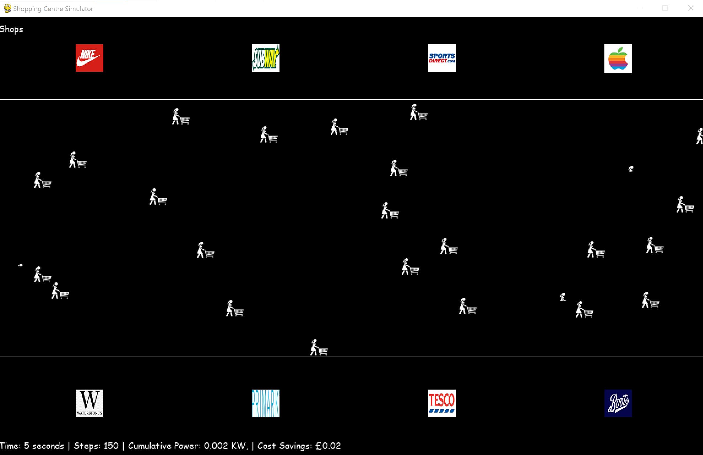

# Team Piezo - Smart Shopping Centre Simulator
This is a 2D simulator built using Pygame to measure the energy generated by piezoelectric tiles from shopping centre visitors. 

We investigate how number of people, weight and number of steps can have an effect on energy harnessed. Piezoelectricity is the idea of creating energy from pressure and latent heat - this can be used with walking.

Our simulator displays how energy can be generated in a shopping mall, where there is high footage traffic. By generating electricity from piezoelectric tiles, we are not only reducing the need for fossil fuels and carbon emissions, but we are also saving money. 

There is a file in the repository called converter.py that helps us to calculate exactly how much carbon emissions and profits we are estimating. 

You can run this using the following

```
python converter.py
```

You should see a shopping centre with all of the various shoppers like so:


